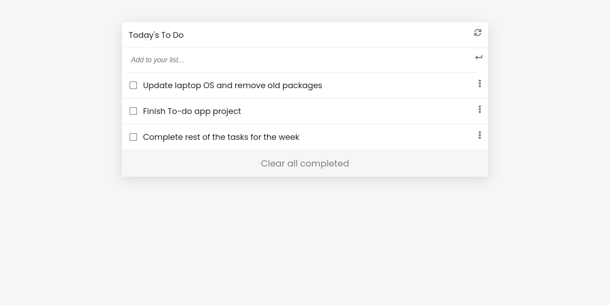

# A Todo App

A web application for managing daily tasks to be completed with functionality to add, remove and edit tasks using a minimalistic design.

## Built With

- HTML
- CSS
- JavaScript
- Webpack
- Minimalist design

## Visit Awesome Books page

[Live Here](coming soon)

## Getting Started

To get a local copy up and running follow these simple example steps.

### Prerequisites

clone repo: `git clone https://github.com/netman5/To-do.git`

then
`cd To-do`

### Install

run `npm install` to install dependencies

## Authors

👤 **Ola Ishola**

- GitHub: [@netman5](https://github.com/netman5)
- Twitter: [@Orlaish](https://twitter.com/Orlaish)
- LinkedIn: [LinkedIn](https://www.linkedin.com/in/ola-ishola/)

## 🤝 Contributing

Contributions, issues, and feature requests are welcome!

Feel free to check the [issues page](../../issues/).

## Show your support

Give a ⭐️ if you like this project!

## Acknowledgments

- Hat tip to anyone whose code was used
- Inspiration
- etc

## 📝 License

This project is [MIT](./MIT.md) licensed.
